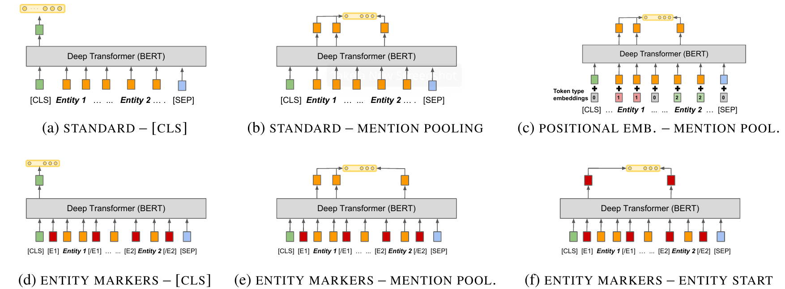

# BERT<sub>EM</sub> for Relation Classification
Unofficial implementation of the first contribution (**BERT<sub>EM</sub>**) from the "MTB"-paper: [Matching the Blanks: Distributional Similarity for Relation Learning](https://arxiv.org/abs/1906.03158). We evaluate this method as baseline in our paper *Why only Micro-$F_1$? Class Weighting of Measures for Relation Classification*.



## Table of Contents
- [Introduction](#introduction)
- [Overview](#-overview)
- [Installation](#-installation)
- [Usage](#-usage)
- [Experiments](#-experiments)
- [Citation](#-citation)
- [License](#-license)

## Introduction
Previous work in **relation classification** (RC) shows great efforts to extract good relation representations. Inspired by the huge success of Transformers in NLP tasks, *Baldini Soares et al.* observes that Transformers (such as BERT) are good relation embedders, and further studies which embedding strategy out of the 6 variants can yield the best performance. 

This repository is for reproducing the results of **BERT<sub>EM</sub>** from their paper: [Matching the Blanks: Distributional Similarity for Relation Learning](https://arxiv.org/abs/1906.03158).

## 🔭&nbsp; Overview
|**Path**|**Description**|
|---|---|
|[configs/](./configs/)|This directory contains the Hydra config files that specify pre-defined settings.|
|[data/](./data/)|This directory where the user should put their data files.|
|[docs/](./docs/)|This directory contains the auxiliary files such as the figures and the license presented in README.|
|[src/mtb/](./src/mtb/)|This directory is the package to be installed, which contains the source code of our implementation.|


## 🚀&nbsp; Installation
### From source
```bash
git clone git@github.com:chen-yuxuan/MTB.git
cd MTB
pip install -e .
```

## 💡&nbsp; Usage
To evaluate the default setting (i.e. `model="bert-large-uncased", variant="f", max_length=512, batch_size=64, num_epochs=5, lr=3e-5, dropout=0`), run:
```bash
python main.py
```

To run your own setting, for example do:
```bash
python main.py variant=a model="bert-base-cased" batch_size=32 num_epochs=10
```

To show the default config, do:
```bash
python main.py --help
```
which results in something like this:

```
== Config ==
Override anything in the config (foo.bar=value)

seed: 1234
cuda_device: 0
train_file: ./data/tacred/train.json
eval_file: ./data/tacred/dev.json
model: bert-large-uncased
variant: f
max_length: 512
batch_size: 64
lr: 3.0e-05
num_epochs: 5
dropout: 0
```

## 🔬&nbsp; Experiments
Here we evaluate the **TACRED** and the **SemEval** datasets. If users have access to the two dataset, then put them under the [./data](./data/) directory, such as `./data/tacred/train.json` (as well as test and dev json files).
### TACRED *with* `bert-base-cased`
|Variant|Max-length|Micro F1-score (%)|
|:-:|-:|-:|
|a|512|18.4|
|b|512|65.8|
|d|512|65.5|
|e|512|66.3|
|f|512|65.7|

### SemEval *with* `bert-large-uncased`
|Variant|Max-length|Micro F1-score (%)|
|:-:|-:|-:|
|a|128|79.4|
|b|128|89.2|
|d|128|88.7|
|e|128|89.6|
|f|128|89.0|

## 📚&nbsp; Citation
```
@inproceedings{baldini-soares-etal-2019-matching,
    title = "Matching the Blanks: Distributional Similarity for Relation Learning",
    author = "Baldini Soares, Livio  and
      FitzGerald, Nicholas  and
      Ling, Jeffrey  and
      Kwiatkowski, Tom",
    booktitle = "Proceedings of the 57th Annual Meeting of the Association for Computational Linguistics",
    month = jul,
    year = "2019",
    address = "Florence, Italy",
    publisher = "Association for Computational Linguistics",
    url = "https://aclanthology.org/P19-1279",
    doi = "10.18653/v1/P19-1279",
    pages = "2895--2905",
    abstract = "General purpose relation extractors, which can model arbitrary relations, are a core aspiration in information extraction. Efforts have been made to build general purpose extractors that represent relations with their surface forms, or which jointly embed surface forms with relations from an existing knowledge graph. However, both of these approaches are limited in their ability to generalize. In this paper, we build on extensions of Harris{'} distributional hypothesis to relations, as well as recent advances in learning text representations (specifically, BERT), to build task agnostic relation representations solely from entity-linked text. We show that these representations significantly outperform previous work on exemplar based relation extraction (FewRel) even without using any of that task{'}s training data. We also show that models initialized with our task agnostic representations, and then tuned on supervised relation extraction datasets, significantly outperform the previous methods on SemEval 2010 Task 8, KBP37, and TACRED",
}
```

## 📘&nbsp; License
**BERT<sub>EM</sub>** is released under the terms of the [MIT License](./LICENSE.md).
